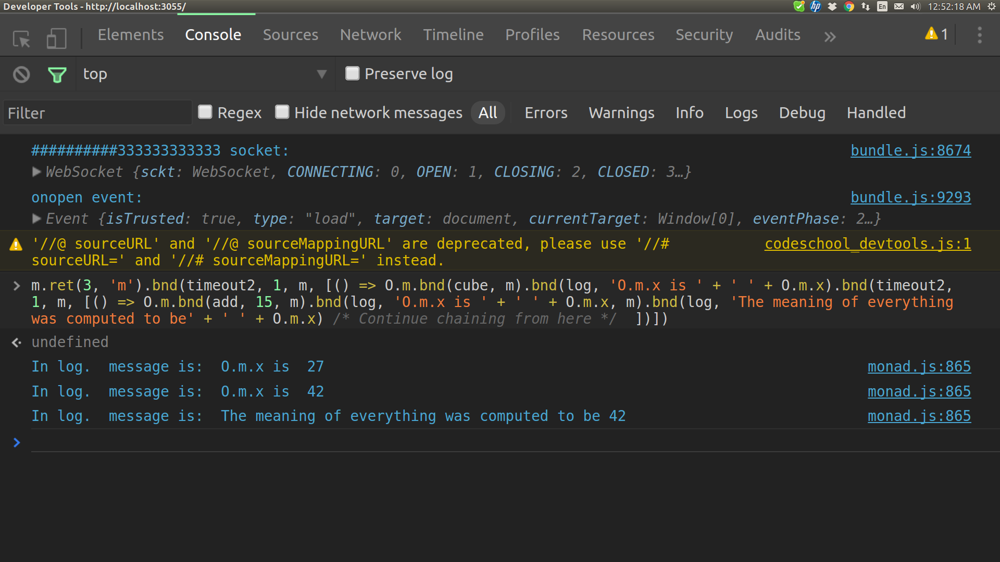

#JS-monads-stable -v1.2

In this version, MonadStream has been dropped. It was dead weight. Simple function calls are now doing what MonadStream instances were doing in the simulated dice game and persistent, shared todo list.

This repository contains the code that is running online at [JS-monads-stable](http://schalk.net:3055) in a [Motorcycle.js](https://github.com/motorcyclejs) application. Motorcycle.js is [Cycle.js](https://github.com/cyclejs/core) using [Most](https://github.com/cujojs/most) and [Snabbdom](https://github.com/paldepind/snabbdom) instead of RxJS and "virtual-dom".  

The use of the monads is explained at [the online presentation](http://schalk.net:3055), which is the running version of this code. There, you can see explanations and demonstrations of a shared, persistent todo list; an interactive simulated dice game with a traversable history of number displays, chat rooms for for each group that is formed to play the game or just to chat, and more.

The term "monad" in this presentation refers to any instance of Monad. Instances of Monad behave like category theory monads in the restricted space in which the bnd() method takes only a single argument, and that argument is a function mapping a Javascript value to an instance of the Monad constructor. But instances of Monad can do much more than that. bnd() can take multiple arguments, and the return value doesn't have to be an instance of Monad.

Here are some definitions, which can also be seen at [the online presentation](http://schalk.net:3055) :
## Basic Monad    
```javascript                 
  var Monad = function Monad(value, ID) {

    var _this = this;

    this.x = value

    if (arguments.length === 1) this.id = 'anonymous';
    else this.id = ID;
  
    this.bnd = function (func, ...args) {
       return func(_this.x, ...args);
    };
  
    this.ret = function (a) {
      O.[_this.id] = new Monad(a, _this.id);
      return O.[_this.id]
    };
  };  
```
##MonadItter
```javascript
  var MonadItter = function MonadItter() {
    var _this = this;
    this.p = function () {};
  
    this.release = function (...args) {
      return this.p(...args);
    };
  
    this.bnd = function (func) {
      _this.p = func;
    };
  }; `
```
## MonadState
```javascript
  var MonadState = function MonadState (g, state, value, p) {
    var _this = this;
    this.id = g;
    this.s = state;
    this.a = value;
    this.process = p;
    this.bnd = function (func, ...args) {
       return func(_this.s, ...args);  // func operates on state
    };
    this.run = function(st) { 
      let s = _this.process(st); 
      let a = s[3];
      window[_this.id] = new MonadState(_this.id, s, a, _this.process);
      return window[_this.id];
    }
  }
```
## Stand alone ret()
```javascript
  var ret = function ret(v, id) {
    if (arguments.length === 1) {
      return (new Monad(v, 'anonymous'));
    }
    window[id] = new Monad(v, id);
    return window[id];
  }
```
## MonadSet
```javascript
  var MonadSet = function MonadSet(set, ID) {
    var _this = this;
  
    this.s = set;
  
    if (arguments.length === 1) this.id = 'anonymous';
    else this.id = ID;
  
    this.bnd = function (func, ...args) {
       return func(_this.x, ...args);
    };
  
    this.add = function (a) {
      var ar = Array.from(_this.s);
      set = new Set(ar);
      set.add(a);
      window[_this.id] = new MonadSet(set, _this.id);
      return window[_this.id];
    };
  
    this.delete = function (a) {
      var ar = Array.from(_this.s);
      set = new Set(ar);
      set.delete(a);
      window[_this.id] = new MonadSet(set, _this.id);
      return window[_this.id];
    };
  
    this.clear = function () {
      set = new Set([]);
      window[_this.id] = new MonadSet(set, _this.id);
      return window[_this.id];
    };
  };

var s = new Set();

var sMplayers = new MonadSet(s, 'sMplayers')  // holds currently online players
```
## MonadItter example
MonadItter instance mMZ3 calls its bnd() method three times. User input releases it three times, each time supplying a number to the quadratic equation `a*x*x + b*x + c = 0 `. When mMZ3 is released the third time, an attempt is made to find solutions using the quadratic formula. Here is the code:
```javascript  
  const quad$ = sources.DOM
    .select('#quad').events('keypress')  // Motorcycle way of getting user input.
  
  const quadAction$ = quad$.map((e) => {
    if( e.keyCode == 13 ) {
      mMZ3.release(e.target.value)       // Releases mMZ3 (below).
      document.getElementById('quad').value = '';
    }
  });

  var solve = function solve () {
    mMZ3.bnd(a => 
    mMtemp.ret(a)           
    .bnd(innerHTML, '', 'quad6', mMtemp)         
    .bnd(innerHTML, a + " * x * x ", 'quad5', mMtemp)
    .bnd(a =>
        mMZ3.bnd(b =>  mMtemp.ret(b)  // After entering the first number, mMZ3 stops here.
        .bnd(innerHTML, " + " + b + " * x ", 'quad6', mMtemp).bnd(b =>
            mMZ3.bnd(c => {           // After entering the second number, mMZ3 stops here.
                let x = qS1(a,b,c);
                let y = qS2(a,b,c);  
                document.getElementById('quad5').innerHTML = 
                  'The results are: x = ' + x + ' and x =';
                document.getElementById('quad6').innerHTML = y; 
                solve();
            })))))
  }();

  var qS1 = function qS1 (a, b, c) {
    let n = (b*(-1)) + (Math.sqrt(b*b - 4*a*c));
    if (n != n) {
      return "No solution";
    }
    return n/(2*a);
  }

  var qS2 = function qS2 (a, b, c) {
    let n = (b*(-1)) - (Math.sqrt(b*b - 4*a*c));
    if (n != n) {
      return "No solution";
    }
    return n/(2*a);
  }  

  var innerHTML = function innerHTML (x, v, u, m) {
    document.getElementById(u).innerHTML = v;
    return m.ret(x);
  }
```
## MonadState Transformer Example
MonadState instances are used to create a list of prime Fibonacci number. More commentary is available at [Demonstration](http://schalk.net:3055). Here are the definitions of fibsMonad and its helper functions:

### fibsMonad
```javascript
  var fibsMonad = new MonadState('fibsMonad', [0, 1, 3, [0,1]], [0,1], fibs_state); 
  
  var fibs_state = function fibs_state(ar) {
    var a = ar.slice();
    while (a[3].length < a[2]) {
      a = [a[1], a[0] + a[1], a[2], a[3].concat(a[0])];
    }
    return a;
  }
```
And here are the definitions of primesMonad and its helper functions:
### primesMonad
```javascript
  var primesMonad = new MonadState('primesMonad', [3, 2, 'primesMonad', [2]], [2],  primes_state)  

  var primes_state = function primes_state(x) {
    var v = x.slice();
      while (2 == 2) {
        if (v[3].every(e => ((v[0]/e) != Math.floor(v[0]/e)))) {
          v[3].push(v[0]);
        }
        if (v[3][v[3].length - 1] > v[2]) { break };     // Not an infinite loop afterall.
        v[0]+=2;
      }
    return v;
  }
```
### MonadState Transformers
Transformers take instances of MonadState and return different instances of MonadState, possibly in a modified state. The method call "fibsMonad.bnd(pfTransformer, primesMonad)" returns primesMonad. Here is the definition of pfTransformer:
```javascript
  var fpTransformer = function transformer (s, m) {
    var bound = Math.ceil(Math.sqrt(s[3][s[3].length - 1]));
    if (bound > m.a[m.a.length - 1] ) {
      m.run([m.s[0], "from the fibKeyPress5$ handler", bound, primesMonad.a])
    }
    return m;
  }
``` 
The final computation occurs when "tr3(fibsState[3],primesState[3]" is called. tr3() takes an array of fibonacci numbers and an array of prime numbers and returns an array containing an array of Fibonacci numbrs, an array of prime numbers, and an array of prime Fibonacci numbers. Here is the definition of tr3:
```javascript
  var tr3 = function tr (fibsArray, primesArray) {
    var bound = Math.ceil(Math.sqrt(fibsArray[fibsArray.length - 1]))
    var primes = primesArray.slice();
    if (primesArray[primesArray.length - 1] >= bound) {
      primes = primesArray.filter(v => v <= bound);
    } 
    var ar = [];
    var fibs = fibsArray.slice(3);
    fibs.map (f => {
      if ( primesArray.every(p => (f % p != 0 || f == p))) ar.push(f);
    })
    return [fibsArray, primes, ar]
  }
 ```
This is how user input is handled:
```javascript  
  const fibKeyPress5$ = sources.DOM
    .select('input#fib92').events('keydown');

  const primeFib$ = fibKeyPress5$.map(e => {
    if( e.keyCode == 13 ) {
      var res = fibsMonad
      .run([0, 1, e.target.value, []])
      .bnd(fibsState => fibsMonad
      .bnd(fpTransformer, primesMonad)
      .bnd(primesState => tr3(fibsState[3],primesState[3])))
      document.getElementById('PF_9').innerHTML = res[0];
      document.getElementById('PF_22').innerHTML = res[1];
      document.getElementById('primeFibs').innerHTML = res[2];
    }
  });
```
##Asynchronous Composition: Promises, MonadItter, or Niether

Using the ES2015 Promises API inside of monads is easy. For example, consider the function "promise", defined as follows:
```javascript
  var promise = function promise(x, t, mon, args) {
    return (new Promise((resolve) => {
      setTimeout(function() {
        resolve(eval("mon.ret(x).bnd(" + args + ")"))   // eval! Get over it, Douglas.
      },t*1000  );
    }));
  };
```
Running the following code causes O.m.x == 42 after two seconds.
```javascript
  m.ret(3).bnd(promise, 2, m, "cube").then(data => m.ret(data.x).bnd(add, 15, m))  
```
After a two-second delay, the Promise returns an anonymous monad with a value of 27 (O.anonymous.x == 27). The then statement passes 27 to m and adds 15 to it, resulting in O.m.x == 42. This pattern can be used to define less trivial functions that handle database calls, functions that don't return immediately, etc. And, of course, ES2015 Promises API error handling can be added.

By the way, the "anonymous monad" isn't entirely anonymous. True, it doesn't have a name, but O.anonymous holds the result of calling cube with only two arguments. "data" is O.anonymous in the expression "data => m.ret(data.x).bnd(add, 15, m)"

The same result can be achieved with MonadItter instead of Promises. Consider this:
```javascript
  var timeout2 = function timeout (x, t, m, args) {
    setTimeout(function () {
      mMZ9.release();
    }, t * 1000  );
    return mMZ9.bnd(() => O.m.bnd(... args))
  };
```
The following code uses timeout2 (above). In the online demonstration, If you click RUN in the online presentation, "O.m.x is 27" appears after one second. Two seconds later, "O.m.x is 42" is displayed along with a blurb that confirms the chain can continue after the delayed computation completes.
```javascript
  const timeoutClicks$ = sources.DOM.select('#timeout').events('click')

  const timeoutAction$ = timeoutClicks$.map(() => {
    document.getElementById('timeout2').innerHTML = ''
    document.getElementById('timeout3').innerHTML = ''
    m.ret(3, 'm')
      .bnd(timeout2, 1, m, [() => O.m
      .bnd(cube, m)
      .bnd(send, 'timeout2', 'O.m.x is ' + ' ' + O.m.x, O.m)
      .bnd(timeout2, 2, m, [() => O.m
      .bnd(add, 15, m)
      .bnd(send, 'timeout2',  'O.m.x is ' + ' ' + O.m.x, O.m)
      /* Continue chaining from here */
      .bnd(send, 'timeout3', 'The meaning of everything was computed to be' + ' ' + O.m.x, O.m)   
    ])]);  
  });
```
Here is a screen shot showing the result of running similar code in the Chrome console:



The final blurb confirms that the chained code waits for completion of the asynchronous code. Similar code could be made to wait for database calls, Ajax requests, or long-running processes to return before running subsequent chained code. In fact, messages$, the stream that handles incoming websockets messages, does just that. A message is sent to the server. A response comes back. Code in MonadItter bnd() blocks is released when the response comes in. Errors could be handled with various techniques, One way to handle errors would be to listen for them with "window.addEventListener("error", function (e) { ...".

Composition with Promises involves chains of ".then" statements. Using MonadItter, composition can be accomplished with Monad's bnd() and ret() methods, just as we have done throughout this presentation.

Handling asychronous event without messy-looking callbacks is easy in this Motorcycle application. There is no need for Promises, a MonadItter instance, or anything special. Plain and simple code is sufficient.

Clicking a button in the online presentation sends a message to the server requesting the names of all members of the group you are in. When the response comes in, the names are extracted from it and displayed in the browser. The browser update waits for the response from the server to come in. The names are then passed to the log function and finally, LOCKED gets reset to true. mMtemp is the glue that holds the chain together. Here is the code:
```javascript  
  const LOCKED = ret(true, 'LOCKED');
  LOCKED.ret(true);   // Creates O.LOCKED

  const requestClicks$ = sources.DOM.select('#request').events('click');

  const requestAction$ = requestClicks$.map(() => {
    if (O.pMgroup.x != 'solo') {         // The default non-group
      LOCKED.ret(false);
      socket.send('NN#$42,' + O.pMgroup.x  + ',' + O.pMname.x + ',' + O.pMgroup );  // Requests names from the server
    }
  });

  const messages2$ = (sources.WS).map(e => {  // Receives the response from the server
    if (!O.LOCKED.x) {
      var v2 = e.data.split(',');
      ret(v2.slice(3))
      .bnd(v => mMtemp.bnd(html,'request2', 'The current online members of ' + O.pMgroup.x + ' are:')
      .bnd(() => mMtemp.bnd(html,'request3', v) 
      .bnd(() => mMtemp.bnd(log, "The member are " + v )
      .bnd(() => LOCKED.ret(true)))))
    }
  });

  var html = function html (x, id, html) {
    document.getElementById(id).innerHTML = html;
    return ret(x);
  }  
``` 
### The Haskell Wai Websockets Back End
This project isn't an exposition of the modified Haskell Wai Websockets server, but I want to point out the similarity between the way the server holds the application's state in a TMVar and the way the front end holds state in an object. The application's state is always changing, so it\'s a pretty safe bet that something is mutating somewhere. The Haskell server for the online demonstration at [JS-monads-stable](http://schalk.net:3055) keeps the ever-changing state of the application in the ServerState list of tupples. It is defined as follows: 
```haskell
type Name = Text
type Score = Int
type Goal = Int
type Group = Text
type Client = (Name, Score, Goal, Group, WS.Connection)
type ServerState = [Client]

newServerState :: ServerState
newServerState = []
```
When the server loads, the line of code 
```haskell
state <- atomically $ newTMVar newServerState
```
When the server is notified of a score change in the simulated dice game, this code executes:
```haskell
else if "CG#$42" `T.isPrefixOf` msg
  then
    mask_ $ do
      old <- atomically $ takeTMVar state
      let new = changeScore sender extraNum extraNum2 old
      atomically $ putTMVar state new
      let subSt = subState sender group new
      broadcast msg subSt
      broadcast ("CB#$42," `mappend` group `mappend` ","
          `mappend` sender `mappend` "," `mappend` T.concat (intersperse "<br>" (textState subSt))) subSt
```
You don't need to be a Haskell programmer to see that state is pulled out of the TMVar and given the name "old". "new" is the state after changeScore sender extraNum extraNum2 old executes. "atomically $ putTMVar state new" replaces "old" in the TMVar with "new".

In the browser, when an instance of Monad, say "m" with m.x == oldValue, executes its ret() method on some reference to a value, let's call it "newValue", O's m attribute points to a fresh Monad instance. O.m.x == oldValue becomes false and O.m.x == newValue becomes true. The Monad instance with m.x == oldValue still exists, and if there is a reference to it, it won't be destroyed by the garbage collector.

In the server, replacing state in the TMVar takes place inside the IO monad, which scupulously protects the application from side effects. But the fact remains that the TMVar ServerState list of clients is not what it used to be after a score change. Some client in the ServerState list has been replaced by a client with the same name, goal, group, and websockets connection but a different score.

###The Motorcycle.js Front-End
In the front-end application, state is held in the global object named "O". As mentioned above, when a monad, say "m", executes m.ret(newValue), m does not mutate. Instead, a new monad named "m" with id "m" and value "newValue" becomes an attribute of O. After that, O.m.x == newValue is true, but m remains unchanged. If O.m previously existed, it is not mutated by this process. If there is no reference to it, it will be subject to obliteration by the garbage collector.

I can't think of a good reason for doing it, but if you want to change the value of m, something like ret(42,'m') will do the job. Suppose m.x == 0 and O.m.x == 0. ret(42,'m') creates a new monad named "m" with m.x == 42. After that, O.m.x == 0 would still be true but m.x == 0 returns false. m.x == 42 returns true. If, after that, you update O.m only by using m's ret() and refrain from mutating m with code like "m.x = newValue", the application will proceed as though nothing happened. The most recent update of m will always be in O.

If you want to go a step further and mutate m, nothing prevents you from calling "m.x = 8888", O.m.x = "WTF", and such. If I ever recruit people to help develop an application, I might ask them to update Monad instances only by using the ret() method so everyone could confidently look to the "O" object for changes in Monad instances' state. 

### MonadItter
MonadItter instances are useful only when their bnd() method is used; and when bnd() is used, the "p" attribute becomes the argument to bnd(). I think this is a situation in which it is wise to take advantage of the fact that Javascript allows p to morph into the bnd() argument. Words like "dogmatic", "religous", and "obsessive" come to mind when I think of imposing consistency on this project by eliminating the only exception (other than "O") to the general no-mutations policy. If I find that it interferes with JavaScript engine optimization, I will reconsider.
 
### Implications of "O" for Cycle.js and Motorcycle.js
[Cycle.js](https://github.com/cyclejs/core) has been criticized for not keeping state in a central location. Well, there it is, in O. I have created applications using Node.js and React.js. [Motorcycle.js](https://github.com/motorcyclejs) is such a relief. It and the monads presented here work well together. As previously mentioned, Motorcycle.js is Cycle.js, only using [Most](https://github.com/cujojs/most) and [Snabbdom](https://github.com/paldepind/snabbdom) instead of RxJS and "virtual-dom").

##[The Online Demonstration](http://schalk.net:3055)
The online demonstration features a game with a traversible dice-roll history; group chat rooms; and a persistent, multi-user todo list. People in the same group share the game, chat messages, and whatever todo list they might have. Updating, adding, removing, or checking "Complete" by any member causes every member 's todo list to update. The Haskell websockets server preserves a unique text file for each group's todo list. Restarting the server does not affect the lists. Restarting or refreshing the browser window causes the list display to disappear, but signing in and re-joining the old group brings it back. If the final task is removed, the server deletes the group's todo text file. 

With Motorcycle.js, the application runs smoothly and is easy to understand and maintain. I say "easy to understand", but for people coming from an imperitive programming background, some effort must first be invested into getting used to functions that take functions as arguments, which are at the heart of Motorcycle and JS-monads-stable. After that, seeing how the monads work is a matter of contemplating their definitions and experimenting a little. Most of the monads and the functions they use in this demonstration are immediately available in the browser console. If you have the right dev tools in Chrome or Firefox, just load [http://schalk.net:3055](http://schalk.net:3055) and press F12 and then Ctrl-R to re-load with access to the monad.js script. I do this to troubleshoot and experiment. Try mM25.bnd(mM25.ret).x == mM25.x and see that it returns true.

.
.

